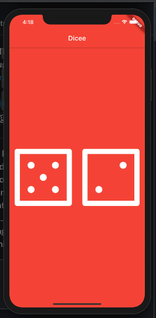

## Dice App 
An App that introduces the Stateful Widgets

### New Widgets used
- Center
- Expanded
- FlatButton
- Stateful

### Key Facts Learned

When using the variables the affects the state of the variables and which in turn affects the display
then we need to go for a Stateful widget. Just Start typing `stful`.

Also build the Widget as you would build a Stateful Widget but just that the `ful` Widget comes with 2 classes
- the widget itself
- the state

We will be handling all the variables that affect the UI in this State class. Another fact to remember is when updating the variable values and if we want to repaint the screen, we need to do the same in the the state class within a `setState` block, which actually triggers the repaint of the component whenever called for.The variables must be declared at a `State` class level and not inside the build method.

### Completed Project

